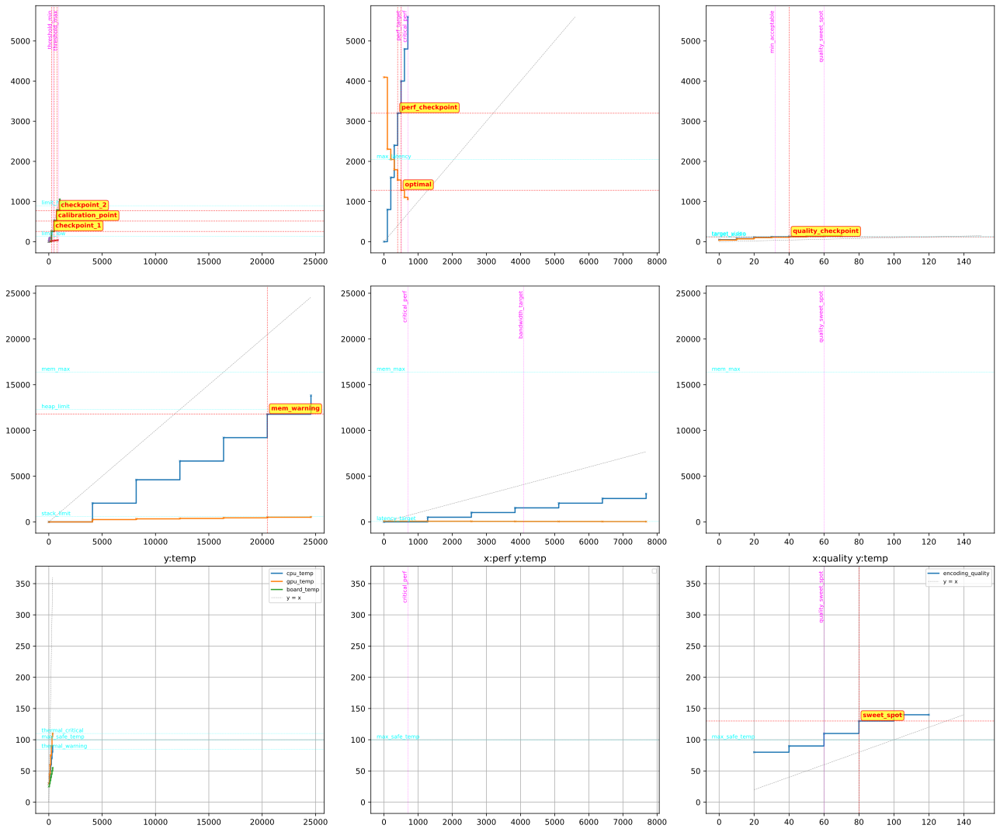

# logplot

A powerful and flexible generic XY curve plotter for log files with support for multi-subplot layouts, marker lines, and wildcard matching.



## Features

- **Multi-series plotting**: Plot multiple data series on the same subplot with automatic color cycling
- **Subplot grid layout**: Organize plots into rows and columns using intuitive tagging syntax
- **Marker lines**: Add vertical, horizontal, and crosshair markers to highlight important values
- **Wildcard support**: Apply markers across entire rows or columns of subplots
- **Axis alignment**: Automatically align axes for subplots in the same row/column (optional)
- **Hexadecimal support**: Parse hexadecimal values with mandatory lowercase `0x` prefix
- **Step plots with scatter**: Visualize discrete data points with step functions and markers

## Installation

Requires Python 3 with matplotlib:

```bash
pip install matplotlib
```

## Usage

Basic usage:

```bash
./logplot logfile.txt
```

Options:

```bash
./logplot [OPTIONS] logfile

Options:
  -o, --out FILE          Save plot to file (PNG, SVG, PDF, etc. - format auto-detected from extension)
  --no-show               Don't display interactive window
  --no-align-axes         Don't align axes for subplots in same column/row
  -h, --help              Show help message
```

## Log Format

### Basic Data Series

Plot XY data points with labels:

```
[label] 0xX 0xY
```

Multiple labels can share the same X value:

```
[label1][label2][label3] 0xX 0xY1 0xY2 0xY3
```

### Explicit XY Format

Use the `xy` keyword to explicitly specify coordinates:

```
[label] xy 0xX 0xY
```

### Marker Lines

**Vertical lines:**
```
[label] x 0xValue
```

**Horizontal lines:**
```
[label] y 0xValue
```

**XY crosshairs** (draws both vertical and horizontal lines with label at intersection):
```
[label] xy 0xX 0xY
```

### Subplot Organization

Use angle brackets `<>` to organize plots into a grid:

**Column specification** (before label):
```
<column_name>[label] 0xX 0xY
```

**Row specification** (after label):
```
[label]<row_name> 0xX 0xY
```

**Both row and column:**
```
<column_name>[label]<row_name> 0xX 0xY
```

**Examples:**
- `<perf>[throughput] 0x100 0x200` - Place in "perf" column, default row
- `[memory]<stats> 0x100 0x200` - Place in default column, "stats" row
- `<perf>[cpu]<temp> 0x50 0x75` - Place in "perf" column, "temp" row

### Wildcard Markers

Apply markers across entire rows or columns using empty angle brackets `<>`:

**Across entire column** (all rows):
```
<column_name>[label]<> x 0xValue
```

**Across entire row** (all columns):
```
<>[label]<row_name> y 0xValue
```

**Across all subplots:**
```
<>[label]<> xy 0xX 0xY
```

## Example

See `comprehensive_test.log` for a complete example demonstrating all features.

Quick example:

```
# Default subplot
[baseline][target] 0x0 0x0 0x0
[baseline][target] 0x100 0x100 0x105
[baseline][target] 0x200 0x200 0x210

# Marker in default subplot
[threshold] x 0x150

# Performance column
<perf>[throughput][latency] 0x0 0x0 0x1000
<perf>[throughput][latency] 0x100 0x500 0x800
<perf>[max_throughput] x 0x200

# Memory row
[heap]<mem> 0x0 0x0
[heap]<mem> 0x1000 0x800
[limit]<mem> y 0x1000

# Wildcard marker across performance column
<perf>[critical]<> x 0x180
```

## Output

The tool generates a grid of subplots where:
- Each unique column tag creates a new column
- Each unique row tag creates a new row
- Empty tags (no `<>`) use the default subplot (column 0, row 0)
- Column and row labels are sorted alphabetically
- Axes are automatically aligned for subplots in the same row/column (unless `--no-align-axes` is used)

### Output Formats

The output format is automatically determined by the file extension:

```bash
./logplot logfile.txt --out output.png    # PNG format
./logplot logfile.txt --out output.svg    # SVG format (vector graphics)
./logplot logfile.txt --out output.pdf    # PDF format
./logplot logfile.txt --out output.eps    # EPS format
```

SVG format is recommended for publications and documentation as it provides scalable vector graphics.

## Data Format Details

### Hexadecimal Values

- Prefix must be lowercase `0x` (uppercase `0X` is not supported)
- Hex digits can be uppercase or lowercase: `0xABCD` or `0xabcd`
- Leading zeros are supported: `0x00001234`
- Sentinel values `0xffffffff` and `0xffffffffffffffff` are ignored

### Visualization

- **Step plots**: Data series are drawn as step functions with small `x` markers
- **Y=X diagonal**: A gray dashed line is automatically added when data is present
- **Color cycling**: Each series gets a unique color from the matplotlib color cycle
- **Grid**: Grid lines are enabled by default for easier reading

## License

MIT License - See LICENSE file for details
